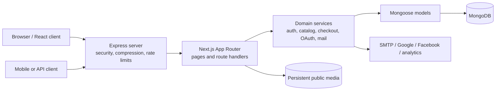

# V4Local multivendor marketplace

V4Local is a full-stack multivendor marketplace built with Next.js App Router, React, Express, Node.js, MongoDB, and Mongoose. It contains a public storefront, customer accounts, seller operations, admin/staff workspaces, a compatibility API for mobile clients, transactional commerce services, and deterministic migration tooling for the original marketplace data.

The active runtime contains no Laravel, PHP, Composer, Blade, MySQL, or Laravel Mix dependency. Historical migration details and the completed cleanup record are available in [MIGRATION.md](MIGRATION.md).

## Contents

- [Implementation status](#implementation-status)
- [Architecture](#architecture)
- [Technology stack](#technology-stack)
- [Project structure](#project-structure)
- [Features](#features)
- [Roles and permissions](#roles-and-permissions)
- [Routing](#routing)
- [API reference](#api-reference)
- [Authentication and security](#authentication-and-security)
- [Checkout, inventory, and settlement accounting](#checkout-inventory-and-settlement-accounting)
- [MongoDB data model](#mongodb-data-model)
- [Localization and currency conversion](#localization-and-currency-conversion)
- [Local installation](#local-installation)
- [Environment configuration](#environment-configuration)
- [Data migration and seeding](#data-migration-and-seeding)
- [Validation and testing](#validation-and-testing)
- [Production deployment](#production-deployment)
- [Operations and backups](#operations-and-backups)
- [Known boundaries](#known-boundaries)
- [Troubleshooting](#troubleshooting)

## Implementation status

The following distinction is important when operating the application:

| Status | Meaning |
| --- | --- |
| Implemented | The route has a working UI or API workflow backed by MongoDB. |
| Feature-controlled | The implementation is shown only when its MongoDB business setting or add-on is active. |
| Provider-controlled | The implementation additionally requires external credentials. |
| Reserved | A protected compatibility route or navigation entry exists, but the external processor or bulk operation is not implemented. It fails explicitly instead of reporting false success. |

### Implemented end-to-end

- Public catalog, categories, brands, verified shops, product details, search, featured items, and deals.
- Product variants, authoritative server-side pricing, stock checks, minimum quantities, cart, comparison, and wishlist.
- Guest and authenticated cash-on-delivery checkout.
- MongoDB cart checkout through the compatibility API.
- Coupons, taxes, multiple shipping calculation modes, seller commission, ledgers, and settlement balances.
- Idempotent order creation and duplicate-submit protection.
- Customer cancellation with inventory and commission reversal.
- Seller item-level fulfillment progression and admin/staff order control.
- Admin/staff payment marking, seller withdrawal approval, and withdrawal payment.
- Customer, seller, admin, and staff workspaces.
- Profile and password changes, saved addresses, tickets, conversations, invoices, reviews, and digital downloads.
- Password recovery, optional email verification, Google/Facebook OAuth, web sessions, and expiring bearer tokens.
- Language, RTL, and currency preferences backed by MongoDB.
- Newsletter subscription, product image uploads, robots rules, and a dynamic sitemap.
- Health checks, rate limits, audit records, data migration validation, and production smoke tests.

### Controlled by settings or credentials

- Wallet navigation and checkout require `business.wallet_system`. Wallet checkout also requires MongoDB transaction support.
- Coupons require `business.coupon_system`.
- Cash on delivery requires `business.cash_payment`.
- Classified listings require `business.classified_product`.
- The affiliate navigation requires an active `affiliate_system` add-on record.
- Email verification requires `business.email_verification` and complete SMTP configuration.
- Google/Facebook login requires both its `business.*_login` setting and provider credentials.
- Google Analytics and Facebook Pixel require both their business setting and public identifier.

### Reserved or deliberately unavailable

- Non-COD compatibility payment routes currently return `503` and do not mark an order paid. Stripe, PayPal, Razorpay, and other keys in the environment template are reserved for a future gateway implementation.
- The bulk product import/export navigation routes are protected compatibility placeholders; there is no CSV/XLSX processor in the current code.
- Roles are migrated and visible, but granular permissions stored inside role documents are not yet evaluated. `admin` and `staff` currently share administrative access.
- Features disabled in MongoDB are hidden from customer/seller navigation or return a deliberate unavailable/not-found response.

## Architecture



`server.mjs` is the single Node.js entrypoint. It prepares Next.js, opens the MongoDB connection, then exposes the Next request handler through Express. Express supplies the outer HTTP concerns: Helmet headers, response compression, authentication/API rate limits, readiness reporting, proxy configuration, and graceful shutdown.

Business endpoints are Next.js route handlers under `src/app/api`. Shared business rules live under `src/lib`; route handlers do not trust totals, prices, seller identifiers, or customer identifiers supplied by clients.

### Request lifecycle

1. Express receives the request and applies the appropriate rate limit and HTTP middleware.
2. Next.js resolves an App Router page or route handler.
3. Protected routes revalidate the signed session or hashed bearer token and active MongoDB user.
4. Zod validates request boundaries.
5. Domain services apply authorization and commerce invariants.
6. Mongoose performs validated writes or a transaction.
7. The route returns a controlled JSON response, redirect, or rendered React page.

## Technology stack

| Layer | Implementation |
| --- | --- |
| UI | React 19, server components, client components, custom CSS |
| Web framework | Next.js 16 App Router |
| HTTP host | Express 5 |
| Database | MongoDB through Mongoose 9 |
| Validation | Zod 4 and Mongoose validators |
| Passwords | bcryptjs with cost factor 12 for new/changed passwords |
| Sessions and state | Signed HS256 JWTs through `jose` |
| Email | Nodemailer over SMTP |
| Server protection | Helmet, Express rate limit, request-size limits, authorization scopes |
| Build and language | TypeScript 5, Node.js ES modules, Turbopack production build |

The final migration was validated with Node.js `22.16.0` and npm `11.7.0`.

## Project structure

```text
.
├── data/
│   ├── i18n/                     # Migrated language dictionaries
│   └── mongodb/legacy-export.json# Complete normalized source export
├── public/
│   ├── uploads/                  # Marketplace media; deployment data
│   ├── shop/                     # Shop media
│   ├── download/                 # Migrated digital files
│   └── frontend/images/          # Required shared imagery
├── scripts/
│   ├── import-mongo-data.mjs     # Deterministic validation/import
│   ├── audit-migration.mjs       # Live DB/reference/asset audit
│   ├── seed-mongodb.mjs          # Fresh development seed
│   └── smoke-runtime.mjs         # Isolated production runtime test
├── src/
│   ├── app/                      # Pages, layouts, metadata, route handlers
│   ├── components/               # Storefront and workspace UI
│   ├── lib/                      # Domain services and shared utilities
│   └── models/index.ts           # Mongoose schemas and indexes
├── server.mjs                    # Express + Next production/dev server
├── next.config.ts
├── package.json
└── tsconfig.json
```

`public/uploads` is intentionally ignored by Git. It must be backed up and mounted on persistent storage in production.

## Features

### Storefront

- Homepage sliders, featured categories, featured products, current deals, and featured brands.
- Catalog filtering by search text, category, brand, seller, featured state, and deal state.
- Search input is length-limited and regex escaped before MongoDB querying.
- Public category, brand, verified-shop, and shop-product pages.
- Product detail pages with variant selection, price, discount, stock, rating, minimum quantity, and related products.
- Variant-aware cart lines keyed by product and selected variation.
- Browser cart persistence, quantity control, cart summary, and checkout handoff.
- Wishlist actions for authenticated users.
- Browser-local comparison list for up to four products.
- Feature-aware classified listings.
- Language and currency selectors.
- Newsletter subscription with idempotent email upsert.
- Secure order tracking requiring both order code and matching email/phone or the owning session.
- Generated `robots.txt` and database-backed `sitemap.xml`.

### Customer account

- Customer registration and signed web session.
- Optional email-verification activation.
- Login, logout, forgot-password, and single-use password-reset links.
- Google and Facebook login when enabled.
- Dashboard metrics for orders, wishlist, open tickets, and wallet/address state.
- Profile and phone editing.
- Password change requiring the current password; changing a password invalidates bearer tokens.
- Up to 20 saved addresses, one default address, default reassignment after deletion, and ownership-scoped CRUD.
- Purchase history and invoice access.
- Cancellation of pending, unpaid orders.
- Review submission only after a paid item is delivered.
- Paid digital-product download authorization.
- Support ticket creation and replies.
- Conversation creation and replies.
- Wishlist, wallet history, affiliate, and classified sections when enabled.

### Seller workspace

- Seller registration creates a pending-verification shop with a collision-resistant slug.
- Dashboard product, order, review, and settlement metrics.
- Seller-owned product CRUD, including physical/digital state, media paths, variants, stock, tax, discount, shipping, and publication flags.
- Product image upload for PNG, JPEG, and WebP files.
- Shop read/update scoped to the authenticated owner. Sellers cannot change shop owner, verification status, or activation state.
- Seller order view contains only the seller's items from multivendor orders.
- Fulfillment progression enforces `pending → confirmed → processing → shipped → delivered` for non-administrative updates.
- Item cancellation restores product and variant stock and reverses the completed seller ledger entry.
- Settlement ledger/payment history.
- Withdrawal requests limited by available settlement balance minus pending/approved requests.
- Reviews, tickets, and conversations scoped to seller-owned resources.

### Admin and staff workspace

- Marketplace dashboard with product, order, seller, and gross-sales metrics.
- Catalog management for products, category hierarchy, brands, attributes, variants, and publication state.
- Marketplace views for sellers, customers, reviews, commissions, withdrawals, classified data, and affiliate data.
- Marketing views for deals, coupons, subscribers, sliders, banners, and home categories.
- Support ticket, conversation, and pickup-point administration.
- Stock, sales, seller, and wishlist report views.
- General/business settings, feature activation, payments, shipping, currencies, languages, roles, staff, pages, countries, add-ons, and SEO data.
- Dedicated all-order view and administrative item status updates.
- Administrative `paid` transition for unpaid/pending orders.
- Withdrawal transitions: pending to approved/rejected, then approved to paid.
- Generic management mutations are field-allow-listed and recorded in `auditlogs`.
- Soft deletion for core catalog/user entities; protected collections use dedicated workflows or deny deletion.

### Mobile and compatibility API

- Customer signup, login, logout, current-user lookup, social access-token login, and password recovery.
- Opaque bearer tokens are random, stored only as SHA-256 hashes, expire automatically, and update `lastUsedAt`.
- Catalog, categories, subcategories, brands, sliders, banners, shops, product details, related products, settings, colors, currencies, reviews, and policies.
- MongoDB cart, wishlist, shipping addresses, customer profile, purchase history, and wallet reads.
- Variant-price quote and coupon quote.
- Cash-on-delivery order creation from the authenticated MongoDB cart.
- User IDs sent by clients are ignored; authenticated identity determines resource ownership.

## Roles and permissions

| Role | Default landing | Principal capabilities |
| --- | --- | --- |
| `customer` | `/dashboard` | Own profile, addresses, orders, reviews, tickets, conversations, wishlist, and enabled customer features |
| `seller` | `/seller/dashboard` | Customer capabilities plus owned products/shop, seller order items, ledger, and withdrawals |
| `admin` | `/admin` | All administrative and seller workspace operations |
| `staff` | `/admin` | Same administrative access as `admin` in the current implementation |

Every session lookup re-reads the account from MongoDB and requires `status: "active"`. Changing a role or banning/deleting an account therefore takes effect without waiting for the signed session to expire.

## Routing

### Public and account pages

| Route | Purpose |
| --- | --- |
| `/` | Storefront homepage |
| `/products` | Catalog; accepts `q`, `category`, `brand`, and `deal=1` |
| `/search?q=...` | Search results |
| `/categories`, `/category/[slug]` | Category browsing |
| `/brands`, `/brand/[slug]` | Brand browsing |
| `/shops`, `/shop/[slug]` | Verified shops and shop catalog |
| `/product/[slug]` | Product detail and variant selection |
| `/compare` | Browser-local comparison |
| `/cart` | Browser cart |
| `/checkout` | Delivery, coupon, and payment selection |
| `/checkout/order-confirmed` | Order confirmation |
| `/track_your_order` | Code plus contact order lookup |
| `/login`, `/register`, `/seller/register` | Authentication/registration |
| `/forgot-password`, `/reset-password` | Password recovery |
| `/social-login/redirect/[provider]` | Start Google/Facebook OAuth |
| `/social-login/[provider]/callback` | Validate state, exchange code, and establish session |
| `/dashboard` | Customer workspace |
| `/seller/[[...section]]` | Seller workspace |
| `/admin/[[...section]]` | Admin/staff workspace |
| `/invoice/[id]` | Ownership/role-checked invoice |
| `/robots.txt`, `/sitemap.xml` | Search-engine metadata |

### Workspace route families

The optional workspace section is resolved against the allow-listed navigation in `src/lib/workspace.ts`.

- Customer examples: `/purchase_history`, `/digital_purchase_history`, `/wishlists`, `/profile`, `/support_ticket`, `/conversations`.
- Seller examples: `/seller/products`, `/seller/orders`, `/seller/payments`, `/seller/withdraw_requests`, `/seller/shop`.
- Admin examples: `/admin/orders`, `/admin/products/seller`, `/admin/categories`, `/admin/coupon`, `/admin/withdraw_requests_all`, `/admin/activation`, `/admin/languages`.

Unknown or unavailable routes do not execute legacy code. The compatibility catch-all either redirects a known alias, renders a migrated CMS/policy page, or produces an explicit unavailable/404 page.

### Legacy-compatible page aliases

- `/users/login` → `/login`
- `/users/registration` → `/register`
- `/shops/visit/[slug]` → `/shop/[slug]`
- `/flash-deal/[slug]` → `/products?deal=1`
- Legacy customer/seller invoice routes → `/invoice/[id]`
- Legacy product edit/bulk export routes → the appropriate protected seller section
- Migrated policy names and published CMS slugs render through the compatibility page

## API reference

All JSON mutation routes validate input. Unless otherwise noted, authenticated web routes use the `v4local_session` cookie and compatibility routes accept `Authorization: Bearer <token>` or an existing web session.

### Core web API

| Method and path | Authentication | Behavior |
| --- | --- | --- |
| `GET /healthz` | Public | Express readiness, database state, and uptime |
| `GET /api/health` | Public | Application/database health and catalog fallback state |
| `POST /api/auth/register` | Public | Customer/seller registration |
| `POST /api/auth/login` | Public | Password login and 14-day web session |
| `GET /logout` | Session | Clears the web session |
| `POST /api/auth/forgot-password` | Public | Non-enumerating reset request |
| `POST /api/auth/reset-password` | Token | Consumes reset token and invalidates bearer tokens |
| `GET /api/auth/verify-email?token=...` | Token | Activates a pending account |
| `POST /api/orders` | Optional session | Guest/account checkout; requires a UUID idempotency key |
| `POST /api/preferences` | Public | Validates and stores language/currency cookies |
| `POST /api/subscribers` | Public | Idempotent newsletter subscription |
| `POST /api/uploads` | Seller/admin/staff | Stores a validated product image, maximum 5 MB |
| `GET /api/downloads/[itemId]` | Session | Streams a paid digital purchase after ownership validation |

### Account workflow API

Base path: `/api/account/*`. These endpoints require a web session.

| Resource | Methods | Notes |
| --- | --- | --- |
| `profile` | `GET`, `PATCH` | Profile and optional password change |
| `addresses` | `GET`, `POST`, `PATCH`, `DELETE` | Ownership scoped; maximum 20 |
| `tickets` | `GET`, `POST`, `PATCH` | Create/list/reply; closed tickets reject replies |
| `conversations` | `GET`, `POST`, `PATCH` | Participant-scoped messages |
| `orders` | `GET` | Customer, seller-item, or all-admin scope |
| `orders/status` | `PATCH` | Role-aware fulfillment/cancellation |
| `orders/payment` | `PATCH` | Admin/staff marks an order paid |
| `orders/review` | `POST` | Delivered and paid customer item only |
| `withdrawals` | `GET`, `POST`, `PATCH` | Role-aware seller request/admin processing |

### Management API

Base path: `/api/manage/[entity]`.

- `GET` lists up to 100 allow-listed projected records; `?id=` returns a scoped record.
- `POST` creates a record when the entity permits generic creation.
- `PATCH` requires `id` in the JSON body and accepts only allow-listed fields.
- `DELETE ?id=` soft-deletes core products/categories/brands/users or hard-deletes an allowed supporting record.
- Sellers can access only owned `products` and read/update their own `shops`.
- Admin/staff can access all declared entities.
- Orders, payments/ledgers, withdrawals, wishlists, and wallets are read-only here and must use their dedicated workflow.
- Shops, settings, and SEO records have additional create/delete restrictions.

Supported entity names are defined by `entityDefinitions` in `src/lib/workspace.ts`; unknown names return `404`.

### `/api/v1` compatibility families

#### Authentication

- `POST /api/v1/auth/login`
- `POST /api/v1/auth/signup`
- `GET /api/v1/auth/user`
- `GET|POST /api/v1/auth/logout`
- `POST /api/v1/auth/social-login`
- `POST /api/v1/auth/password/create`
- `POST /api/v1/auth/password/forget_request`
- `POST /api/v1/auth/password/confirm_reset`

Successful login returns:

```json
{
  "access_token": "opaque-token-returned-once",
  "token_type": "Bearer",
  "expires_at": "ISO-8601 timestamp",
  "user": {}
}
```

#### Public catalog

- `banners`, `sliders`, `home-categories`
- `categories`, `categories/featured`, `categories/home`
- `sub-categories/[category]`
- `brands`, `brands/top`
- `shops`, `shops/details/[shop]`, `shops/products/...`, `shops/brands/[shop]`
- `products`, `products/home`, `products/featured`, `products/todays-deal`, `products/search`
- `products/[product]`, `products/category/[category]`, `products/brand/[brand]`
- `products/sub-category/[id]`, `products/sub-sub-category/[id]`
- `products/related/[product]`, `products/top-from-seller/[product]`
- `reviews/product/[product]`, `policies/[name]`, settings, currencies, and colors

Identifiers may be MongoDB IDs; several compatibility lookups also accept a legacy numeric ID or slug.

#### Authenticated commerce/account

- Cart: fetch, add, change quantity, and remove.
- Wishlist: fetch, check, add, and remove.
- Shipping addresses: list, create, update, and delete.
- User profile: read and update.
- Purchase history and details.
- Wallet balance and history reads.
- Variant price/stock quote.
- Coupon quote against the authenticated cart.
- Review submission after paid delivery.
- `POST /api/v1/order/store` and `POST /api/v1/payments/pay/cod` for COD cart checkout.

Compatibility responses generally use `{ data, success, status, message }`. Authentication endpoints retain their client-specific response shape.

## Authentication and security

### Web sessions

- `v4local_session` contains a signed HS256 JWT with subject, name, email, and role.
- Lifetime is 14 days.
- Cookie attributes: `HttpOnly`, `SameSite=Lax`, root path, and `Secure` in production.
- The database account is reloaded on every protected session access and must remain active.

### Password and account tokens

- New passwords are 8–200 characters and stored with bcrypt cost factor 12.
- Login performs a dummy bcrypt comparison for missing accounts to reduce timing-based account discovery.
- Imported `$2y$` bcrypt hashes are normalized for verification without rewriting the original password.
- Password-reset tokens are 48 random bytes, stored only as SHA-256 hashes, single-use, and expire after 60 minutes.
- Email-verification tokens use the same storage design and expire after 24 hours.
- Forgot-password responses do not disclose whether an email exists.
- Password changes/reset invalidate all bearer tokens for the account.

### OAuth

- Supported providers: Google and Facebook.
- OAuth state is random and wrapped in a signed, HTTP-only, 10-minute cookie.
- The post-login destination is restricted to local absolute paths.
- Google login requires a verified provider email.
- Provider accounts are uniquely linked and may attach to an existing account with the same email.
- Provider requests use 15-second network timeouts.

### Bearer tokens

- Tokens contain 48 random bytes and are returned only when issued.
- MongoDB stores only the SHA-256 token hash.
- Default lifetime is 30 days, controlled by `API_TOKEN_DAYS`.
- A TTL index expires token records; logout deletes the active token.
- The client-supplied user ID is never used to decide ownership.

### HTTP and data controls

- Authentication rate limit: default 20 requests per 15 minutes.
- General `/api` limit: default 180 requests per minute; health checks are excluded.
- Helmet security headers and response compression are enabled.
- Express suppresses `X-Powered-By`; Next.js suppresses its powered-by header.
- Zod validates route input and Mongoose validates modeled writes.
- Management routes use field allow-lists, ownership filters, and mutation restrictions.
- Product uploads verify binary signatures instead of trusting extensions/MIME labels.
- Digital downloads and upload destinations are resolved under `public` and reject traversal.
- Generic management mutations create audit records with actor, action, entity, changes, IP, and user agent.
- The server handles `SIGINT`/`SIGTERM`, closes the listener, and disconnects MongoDB.

The application does not currently install a separate CSRF-token middleware. Cookie-authenticated JSON mutations rely on same-site cookies and same-origin browser requests. Add explicit CSRF tokens if the application later accepts cross-site embedded clients or relaxes request-origin/CORS rules.

## Checkout, inventory, and settlement accounting

The server is the authority for every monetary and inventory value. A cart request supplies only product ID, variation, and quantity; prices, discounts, taxes, shipping, seller, commission, and stock are loaded from MongoDB.

### Validation and pricing

1. Validate shipping/contact fields, payment type, lines, and a UUID idempotency key.
2. Reject disabled COD/wallet/coupon features.
3. Collapse duplicate product/variation lines and reject line quantities above 100.
4. Load published products, sellers, shops, categories, settings, and requested variants.
5. Enforce minimum quantity and current product/variant stock.
6. Apply product discount and product tax rules.
7. Calculate shipping using the configured mode:
   - `flat_rate`: one configured total distributed across items;
   - `seller_wise_shipping`: one seller/admin rate distributed across that seller's items;
   - product-wise/default: free or per-product shipping.
8. Apply global or category commission to each item total.
9. Validate coupon dates, spend threshold, usage limit, account reuse, product eligibility, discount type, and maximum discount.
10. Create an immutable order-item snapshot.

### Idempotency

`idempotencyKey` is unique on orders. Web/mobile clients should also send it through the `Idempotency-Key` header. If both header and body keys exist, they must match. Retrying the same key for the same account/guest returns the existing order; attempting to reuse it for another owner returns a conflict.

### Transactions and standalone MongoDB

- Replica set or sharded MongoDB: inventory, wallet, coupons, order, ledgers, and balances run inside a multi-document transaction.
- Standalone MongoDB: COD uses guarded sequential updates and compensating rollback for stock, coupon counters/usages, ledgers, shop balances, and the order.
- Wallet payment is rejected on standalone MongoDB because its monetary balance must remain transactionally atomic.

### Inventory and cancellation

Stock updates use conditional MongoDB filters, so checkout fails if stock changes between quote and commit. Product sales counters and variant stock update with the same guarded write. Cancellation restores product/variant inventory, decreases the sales counter, reverses the completed seller ledger, and compensates `shop.adminToPay`.

### Seller balance convention

- Positive `shop.adminToPay`: the marketplace owes the seller.
- Negative `shop.adminToPay`: a COD seller owes marketplace commission.
- COD order ledger delta: negative commission.
- Wallet/paid marketplace order ledger delta: positive seller earning.
- A paid withdrawal atomically decreases the positive seller balance after verifying sufficient funds.

## MongoDB data model

Core schemas are registered in `src/models/index.ts`.

| Collection/model | Responsibility and important invariants |
| --- | --- |
| `users` | Unique lowercase email, role/status, provider, balance, verification/login state |
| `categories` | One parent/child hierarchy for category, subcategory, and leaf category |
| `brands` | Unique slug and catalog metadata |
| `shops` | One shop per owner, unique slug, verification, COD/bank/settlement data |
| `products` | Unique slug, seller/category references, prices, taxes, shipping, stock, variants, digital file |
| `addresses` | User-owned delivery addresses |
| `orders` | Unique code/idempotency key, immutable item snapshots, payment and status history |
| `reviews` | One review per user/product; rating feeds product average |
| `wishlists` | Unique user/product pair |
| `carts` | One cart per user; cart TTL refreshes for 30 days |
| `wallettransactions` | Debit/credit/refund/recharge history |
| `coupons` / `couponusages` | Coupon rules, counters, and one-use-per-account records |
| `sellerledgers` | Unique order/item/type accounting record and reversal state |
| `withdrawrequests` | Seller request and admin processing lifecycle |
| `tickets` | Ticket state with embedded messages |
| `conversations` | Participants with embedded messages/read state |
| `settings` | Unique grouped business/general/policy settings |
| `currencies` | Active exchange rates and symbols |
| `languages` | Active language, RTL flag, and embedded translations |
| `apitokens` | Hashed bearer tokens with TTL |
| `accounttokens` | Hashed verification/reset tokens with TTL and used state |
| `externalaccounts` | Unique OAuth provider identity links |
| `auditlogs` | Management mutation history |

The importer also preserves supporting marketplace collections such as add-ons, banners, sliders, subscribers, roles, staff source records, countries, attributes, SEO, affiliate data, raw product stock rows, searches, and legacy reporting data.

### Migrated dataset state

- Source export: 48 source tables and 1,310 rows.
- Normalized import output: 1,218 documents before runtime-only collections.
- Verified users: 48 total; 32 retain bcrypt password hashes and 16 have no legacy password hash. Accounts without a password use their provider or password recovery.
- Products: 154.
- Valid embedded variant stock rows: 194.
- Raw stock rows preserved: 239.
- Historical source issue: 45 stock rows refer to missing product IDs `12` and `133`; they remain in `productstocks` but cannot be attached to nonexistent live products.
- Referenced media validated by the migration audit: 898 paths with no missing or unsafe references at the last completed audit.

## Localization and currency conversion

- Migrated languages: English (`en`), Bangla (`bd`), and Arabic (`sa`).
- Translation dictionaries remain in `data/i18n` and are embedded into language documents during import.
- Missing or blank translations fall back to the source key.
- The active language controls the HTML `lang` and `dir` attributes.
- Arabic's migrated RTL state sets `dir="rtl"`.
- Language preference cookie: `v4_locale`, one year.
- Currency preference cookie: `v4_currency`, one year.
- Cookie values are accepted only when a matching active MongoDB record exists.

Stored product/order amounts remain in the configured base currency. Display conversion follows the migrated marketplace rule:

```text
display amount = stored amount / base exchange rate × selected exchange rate
```

Currency preference changes display formatting; checkout and persisted order accounting continue in base units.

## Local installation

### Prerequisites

- Node.js compatible with the versions in `package-lock.json`; Node.js 22 is the validated runtime.
- npm.
- A reachable MongoDB instance.
- SMTP only when email verification or password email delivery is required.

The repository does not bundle a local MongoDB server.

### 1. Install dependencies

```powershell
npm.cmd install
```

For a clean CI/production install using the lock file:

```powershell
npm.cmd ci
```

### 2. Create local configuration

```powershell
Copy-Item -LiteralPath .env.example -Destination .env.local
```

Set at minimum:

```dotenv
NEXT_PUBLIC_APP_URL=http://localhost:3000
AUTH_SECRET=replace-with-a-random-secret-of-at-least-32-characters
MONGODB_URI=mongodb://127.0.0.1:27017/v4local_marketplace
MONGODB_DB=v4local_marketplace
```

Do not commit `.env.local`; it is ignored by the repository.

### 3. Populate MongoDB

To use the fully migrated marketplace dataset:

```powershell
npm.cmd run data:validate
npm.cmd run db:import
npm.cmd run data:audit
```

To create only a fresh development admin and seller, configure the four `SEED_*` values and run:

```powershell
npm.cmd run db:seed
```

Use either import or seed according to the database's purpose. The seed script does not replace the migrated marketplace catalog.

### 4. Start development

```powershell
npm.cmd run dev
```

The default URL is `http://localhost:3000`. The development command runs `server.mjs --dev` with Node watch mode.

## Environment configuration

### Application and MongoDB

| Variable | Required | Default | Purpose |
| --- | --- | --- | --- |
| `NEXT_PUBLIC_APP_URL` | Production | `http://localhost:3000` | Canonical URL, sitemap, mail links, OAuth callbacks |
| `AUTH_SECRET` | Yes | Development fallback only | Minimum 32-character JWT signing secret; server startup enforces it |
| `PORT` | No | `3000` | Express listen port |
| `HOST` | No | `0.0.0.0` | Express bind address |
| `DEFAULT_LANGUAGE` | No | `en` | Language selected when no cookie exists |
| `ALLOW_DEMO_DATA` | No | `false` | Development catalog fallback; keep false in production |
| `MONGODB_URI` | Yes | None | MongoDB connection URI |
| `MONGODB_DB` | No | URI database | Explicit database name |
| `MONGODB_MAX_POOL_SIZE` | No | `10` | Maximum Mongoose connection pool |
| `MONGODB_MIN_POOL_SIZE` | No | `0` | Minimum connection pool |
| `MONGODB_SERVER_SELECTION_TIMEOUT_MS` | No | `3000` | App Router connection-selection timeout |

### Express and API

| Variable | Default | Purpose |
| --- | --- | --- |
| `TRUST_PROXY_HOPS` | `0` | Number of trusted proxy hops; set correctly behind a load balancer |
| `API_RATE_LIMIT` | `180` | Requests per minute under `/api` |
| `AUTH_RATE_LIMIT` | `20` | Authentication requests per 15 minutes |
| `API_TOKEN_DAYS` | `30` | Compatibility bearer-token lifetime |

### SMTP

| Variable | Purpose |
| --- | --- |
| `SMTP_HOST` | SMTP hostname |
| `SMTP_PORT` | SMTP port; defaults to 587 |
| `SMTP_USER`, `SMTP_PASSWORD` | SMTP credentials |
| `SMTP_SECURE` | `true` for implicit TLS; port 465 also enables it |
| `MAIL_FROM` | Required sender address |
| `MAIL_FROM_NAME` | Sender display name; defaults to V4Local |

SMTP connections use 10-second connection/greeting timeouts and a 20-second socket timeout.

### OAuth and analytics

| Variable | Purpose |
| --- | --- |
| `GOOGLE_CLIENT_ID`, `GOOGLE_CLIENT_SECRET` | Google OAuth |
| `FACEBOOK_CLIENT_ID`, `FACEBOOK_CLIENT_SECRET` | Facebook OAuth |
| `NEXT_PUBLIC_GOOGLE_ANALYTICS_ID` | Google Analytics tag when enabled in settings |
| `NEXT_PUBLIC_FACEBOOK_PIXEL_ID` | Facebook Pixel ID when enabled in settings |

Register these exact callback URLs with the providers:

```text
{NEXT_PUBLIC_APP_URL}/social-login/google/callback
{NEXT_PUBLIC_APP_URL}/social-login/facebook/callback
```

### Seed and test variables

| Variable | Purpose |
| --- | --- |
| `SEED_ADMIN_EMAIL`, `SEED_ADMIN_PASSWORD` | Fresh seed admin |
| `SEED_SELLER_EMAIL`, `SEED_SELLER_PASSWORD` | Fresh seed seller |
| `SMOKE_PORT` | Optional smoke server port; defaults to 3210 |

Historical unsupported provider settings migrated from the retired environment use `LEGACY_*` names in the private `.env.local`. They are retained for operator reference but are not read by the current runtime.

## Data migration and seeding

### Validate without writing

```powershell
npm.cmd run data:validate
```

This parses and transforms `data/mongodb/legacy-export.json`, reports source/collection counts, and checks required product/order shape without connecting to MongoDB.

### Import or update migrated data

```powershell
npm.cmd run db:import
```

The importer:

- normalizes historical whitespace;
- deterministically maps relational IDs to ObjectIds;
- consolidates category levels;
- embeds order details, ticket replies, conversation messages, and valid variants;
- retains immutable order snapshots;
- embeds translations into language documents;
- upserts documents without duplicating them;
- creates required indexes;
- runs duplicate, role, whitespace, and relationship checks after writing.

The source JSON is the repeatable migration input. Do not edit it manually unless deliberately creating a new migration source.

### Seed a fresh development database

```powershell
npm.cmd run db:seed
```

The seed refuses missing or short passwords and creates a minimal admin, seller, shop, category, products, and baseline settings. It is intended for development, not as an update mechanism for the migrated database.

## Validation and testing

| Command | Writes data? | Purpose |
| --- | --- | --- |
| `npm.cmd run typecheck` | No application data | Strict TypeScript validation |
| `npm.cmd run build` | Build output only | Optimized Next.js production build and route compilation |
| `npm.cmd run check` | Build output only | Type check followed by production build |
| `npm.cmd run data:validate` | No | Dry-run source transformation |
| `npm.cmd run data:audit` | No | Live MongoDB counts, references, variants, translations, passwords, and media paths |
| `npm.cmd run db:import` | Yes | Idempotent source-data upsert and index creation |
| `npm.cmd run db:seed` | Yes | Minimal development data |
| `npm.cmd run test:smoke` | Temporary fixtures | Build and production workflow test |

### Smoke-test coverage

`npm.cmd run test:smoke`:

- builds the production application;
- creates isolated seller/admin/category/shop/product fixtures;
- temporarily disables email verification for its generated customer;
- starts the real Express/Next server;
- tests public pages, health, preferences, registration, sessions, bearer login/logout, role authorization, and addresses;
- places idempotent web COD and mobile-cart COD orders;
- verifies inventory, sales counters, commission, cart clearing, and cancellation reversal directly in MongoDB;
- tests seller status progression, admin payment marking, invoice access, and secure tracking;
- removes its fixtures and restores the original verification setting in `finally` cleanup.

Although cleanup is automatic, run the smoke suite against a development or staging database, not a production database, because it temporarily changes one business setting and creates transactional fixtures.

## Production deployment

### Recommended topology

- A long-running Node.js service executing `server.mjs`.
- MongoDB replica set or MongoDB Atlas for transactional checkout.
- TLS reverse proxy or load balancer.
- Persistent filesystem or shared volume for `public/uploads`, `public/shop`, and `public/download`.
- External process supervision that sends `SIGTERM` during deploy/shutdown.

### Build and start

```powershell
npm.cmd ci
npm.cmd run typecheck
npm.cmd run build
npm.cmd start
```

The production start command does not load `.env.local` itself through a separate dotenv package. Next.js loads its environment files during startup/build; platform-level secrets are preferred for production.

### Deployment checklist

1. Set `NODE_ENV=production` through the hosting environment.
2. Set a unique `AUTH_SECRET` of at least 32 characters.
3. Set the canonical HTTPS `NEXT_PUBLIC_APP_URL`.
4. Use a least-privilege MongoDB account and a replica-set URI.
5. Configure `TRUST_PROXY_HOPS` to match the real proxy chain.
6. Keep `ALLOW_DEMO_DATA=false`.
7. Mount and back up persistent media paths.
8. Configure SMTP/OAuth only for features enabled in MongoDB.
9. Run `data:audit`, type checking, and the production build before rollout.
10. Use `/healthz` for readiness and `/api/health` for application/database monitoring.

Do not run `db:import`, `db:seed`, or `test:smoke` automatically on every production process start.

## Operations and backups

Back up these together:

- the MongoDB database;
- `public/uploads`, `public/shop`, and `public/download`;
- production secrets/provider configuration;
- `data/mongodb/legacy-export.json` and `data/i18n` as migration artifacts.

MongoDB alone is not a complete backup because product/shop/digital files live on the filesystem. Likewise, copying `public` without MongoDB loses ownership, product, and order relationships.

### Health endpoints

- `/healthz`: `200` when the long-running production server considers MongoDB connected; otherwise `503` outside development.
- `/api/health`: pings MongoDB and reports `connected`, `unreachable`, or `not-configured`, plus whether development catalog fallback is active.

### Logging

The Express server writes startup and graceful-shutdown messages to stdout/stderr. Route handlers return controlled client errors but do not currently include a structured centralized logger. Capture process output in the deployment platform and add centralized error reporting before high-volume production use.

## Known boundaries

- Online payment gateway execution/webhooks are not implemented. Only COD and transaction-protected wallet checkout are functional.
- Bulk product CSV/XLSX import/export is not implemented.
- Role-document permission arrays are data only; admin and staff authorization is currently role-level.
- UI translation coverage is limited to keys present in the migrated dictionaries; missing values fall back to English/source text.
- Uploads use local persistent storage and are not automatically replicated to S3 or another object store.
- There is no background queue; email is sent during the request and provider calls have bounded timeouts.
- The generic admin workspace is schema/field driven. Specialized operational workflows should use dedicated route handlers instead of extending generic CRUD with accounting logic.
- The remote payment/provider integrations require live credential and callback testing in the target environment.
- No dedicated remote package-advisory audit is part of the local scripts; run the organization's approved dependency scanner in CI.

## Troubleshooting

| Symptom | Check |
| --- | --- |
| Server exits immediately | Confirm `MONGODB_URI` and an `AUTH_SECRET` of at least 32 characters. |
| `/api/health` is degraded | Check MongoDB network access, database name, credentials, and selection timeout. |
| Catalog shows demo data | Set `ALLOW_DEMO_DATA=false` and restore MongoDB connectivity. |
| Registration with verification fails | Configure all SMTP variables or disable `business.email_verification`. Registration rolls back if verification mail cannot be issued. |
| Password-reset endpoint succeeds but no email arrives | The response is intentionally non-enumerating; inspect SMTP/platform logs and configuration. |
| OAuth option is missing | Both the MongoDB provider setting and provider credentials must be active; verify callback URL. |
| OAuth callback returns to login with an error | Check canonical app URL, state cookie, provider secret, callback registration, and provider email availability. |
| Wallet checkout returns `503` | Use a MongoDB replica set; standalone MongoDB intentionally rejects wallet checkout. |
| COD checkout reports stock changed | Another order modified stock; refresh the cart and retry with a new idempotency key. |
| Retried checkout conflicts | Do not reuse an idempotency key across accounts or different orders. |
| Seller cannot update an order status | Seller transitions must be sequential and can affect only that seller's item. |
| Withdrawal is rejected | Available positive settlement balance must exceed existing pending/approved requests. |
| Image upload returns `415` | File must contain a real PNG, JPEG, or WebP signature, not just the extension. |
| Migrated image is missing | Restore persistent `public` media and run `npm.cmd run data:audit`. |
| Order tracking finds nothing | Supply the exact code and matching order email/phone, or sign in as the owning customer. |
| Import audit reports stock orphans | Product IDs 12 and 133 are absent from the historical source; their 45 stock rows are intentionally preserved only in `productstocks`. |
| Requests return `429` | Review `AUTH_RATE_LIMIT`, `API_RATE_LIMIT`, client retry behavior, and proxy IP configuration. |

## Useful commands

```powershell
# Development
npm.cmd run dev

# Static and production validation
npm.cmd run typecheck
npm.cmd run build
npm.cmd run check

# Data validation and migration
npm.cmd run data:validate
npm.cmd run db:import
npm.cmd run data:audit
npm.cmd run db:seed

# Full isolated production workflow test
npm.cmd run test:smoke

# Start the already-built production server
npm.cmd start
```
